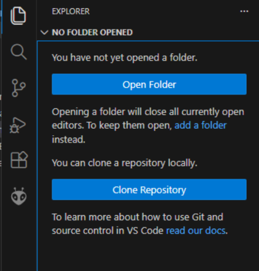
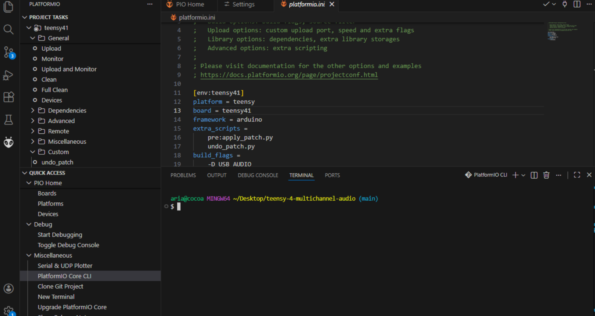

Teensy library patch and example code come from <https://github.com/alex6679/teensy-4-usbAudio>

# Teensy Programming Setup

Install these prerequisites.

- [VSCode](https://code.visualstudio.com/download)
- [PlatformIO VSCode](https://platformio.org/install/ide?install=vscode)
- Windows Only: [Git CLI](https://git-scm.com/install/windows)

## Windows Setup Git CLI

Open VSCode and press F1. Type "Terminal: Select Default Profile" and select
it then select Git Bash and restart VSCode.

## Download Multichannel Audio Repo

In VSCode click the "Clone Repository" button and enter this link
'https://github.com/catarial/teensy-4-multichannel-audio.git'

 

If you don't see the button, make sure you're in an empty workspace by
going to `File > New Window`.

## Compile

Wait for the PlatformIO setup to complete.

To compile type `pio run` and to flash the board type `pio run --target upload`.

Since we have to patch the teensy library to get multichannel audio to work,
it's a good idea to undo the applied patches when you're done by running
`pio run --target undo_patch`

